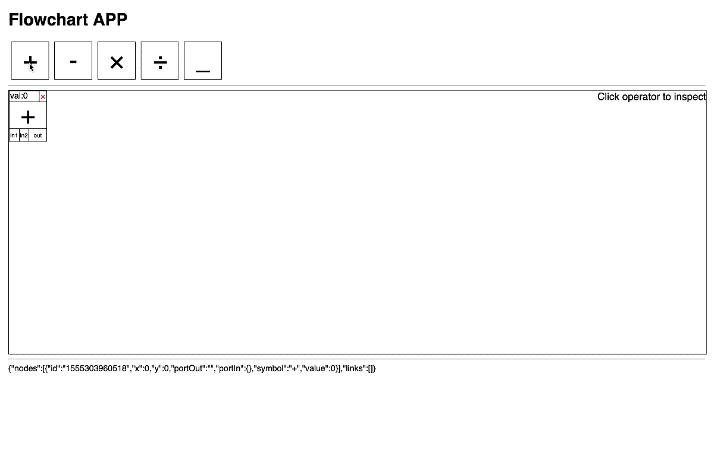
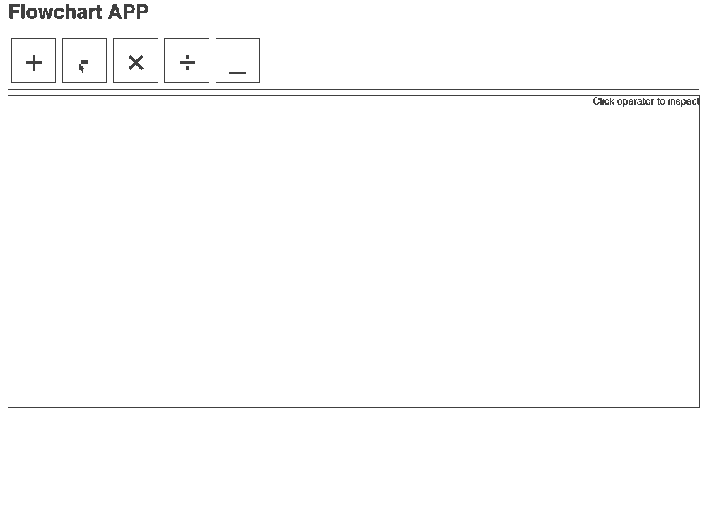

# Flowchart Demo

## Installation and Run

Under project root directory, install node modules

```bash
npm install
```

Run the following command to run the App

```bash
meteor
```

Run the following command to test the App

```bash
TEST_BROWSER_DRIVER=chrome TEST_WATCH=1 meteor test --driver-package meteortesting:mocha --port 3002
```

## Usage

Overall Effect


Click elements on element bar to get a new instance of node

