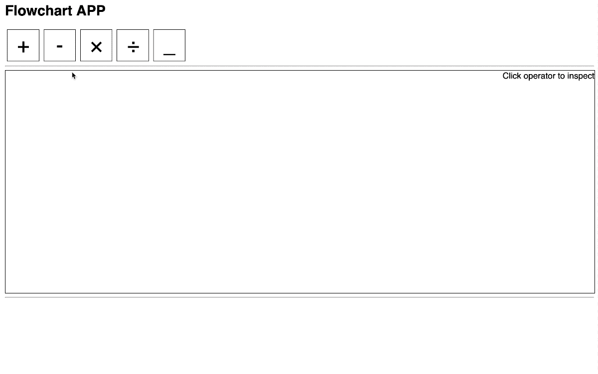
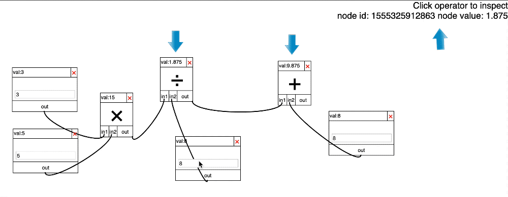

# Flowchart Demo

## Installation and Run

Under project root directory, install node modules

```bash
meteor npm install
```

Run the following command to run the App

```bash
meteor
```

Run the following command to test the App

```bash
TEST_BROWSER_DRIVER=chrome TEST_WATCH=1 meteor test --driver-package meteortesting:mocha --port 3002
```

## Usage

1.Overall Effect


2. Click elements on element bar to get a new instance of node
   

3. Drag from out and drop on another node to link
   

4. Inspect node id by clicking node. Node Info is shown on the top right corner
   

5. Delete node by clicking delete button on the top right corner of node
   

6. Support synchronous value update and propagation when node value changed or node deleted
   
